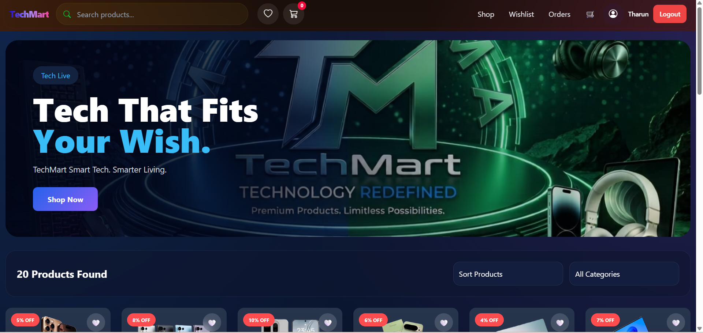
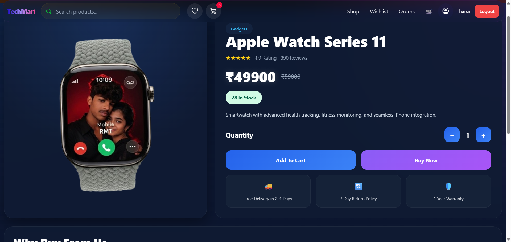
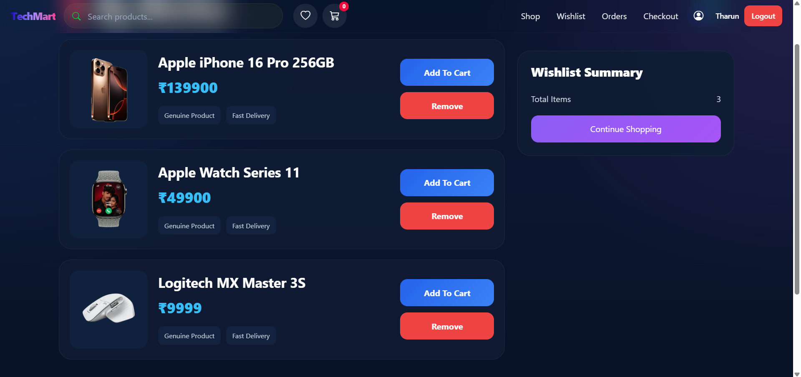
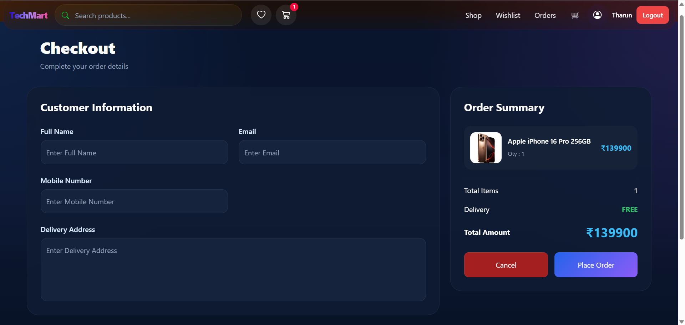
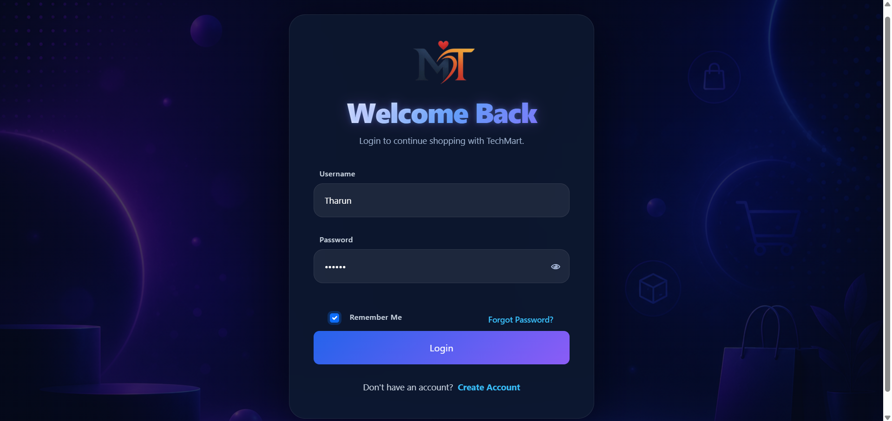
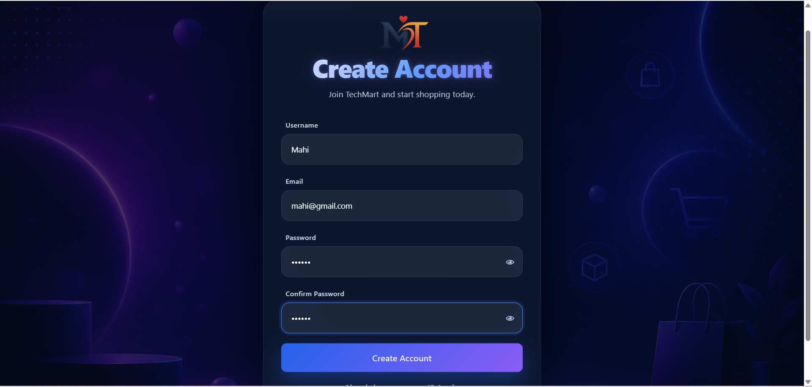
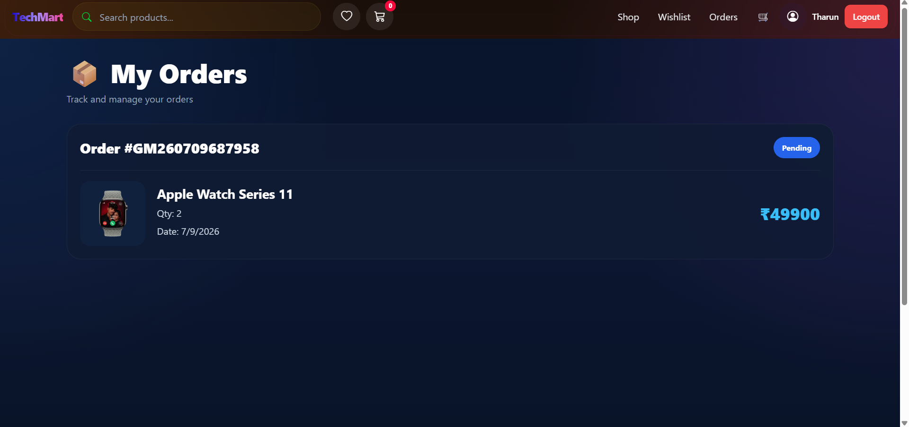

# 🛍️ TechMart - Modern Full Stack E-Commerce Platform

<p align="center">


</p>

<p align="center">
A modern, responsive, and feature-rich full-stack e-commerce web application built using <strong>Django REST Framework</strong> and <strong>React + Vite</strong>.
</p>

---

# ✨ Features

### 🛒 Shopping Experience

* Browse products by category
* Search products instantly
* Product detail page
* Beautiful product cards
* Responsive modern UI
* Product image gallery
* Price display
* Product descriptions

---

### ❤️ Wishlist

* Add products to wishlist
* Remove from wishlist
* Persistent wishlist
* Wishlist synchronization

---

### 🛍 Cart

* Add to cart
* Remove from cart
* Quantity management
* Dynamic total calculation
* Secure checkout flow

---

### 👤 Authentication

* User Registration
* User Login
* JWT Authentication
* Protected Routes
* Secure Logout

---

### 📦 Orders

* Place orders
* Order summary
* Checkout page

---

### ⚙ Backend

* Django REST Framework APIs
* MySQL Database
* Image Upload
* Authentication APIs
* Product APIs
* Order APIs
* Cart APIs

---

# 🛠 Tech Stack

## Frontend

* React
* Vite
* React Router DOM
* Axios
* React Toastify
* CSS Modules

## Backend

* Django
* Django REST Framework
* JWT Authentication
* PyMySQL
* Pillow
* Python

## Database

* MySQL

---

# 📂 Project Structure

```text
TechMart/
│
├── backend/
│   ├── ecommerce/
│   ├── app
│   ├── manage.py
│   └── requirements.txt
│
├── frontend/
│   ├── src/
│   │   ├── Components/
│   │   |
│   │   ├── Pages/
│   │   ├── Services/
│   │   ├── Assets/
│   │   └── App.jsx
│   ├── package.json
│   └── vite.config.js
│
├── screenshots/
├── README.md
└── .gitignore
```

---

# 📸 Screenshots

## 🏠 Home Page



---

## 📱 Product Listing



---

## ❤️ Wishlist



---

## 🛒 Shopping Cart



---

## 🔐 Login



---

## 📝 Register



---

## 📦 Orders



---

# 🚀 Installation

## Clone Repository

```bash
git clone https://github.com/ramaiahgaritharun-svg/techmart.git
```

---

## Backend Setup

```bash
cd backend

python -m venv venv

# Windows
venv\Scripts\activate

pip install -r requirements.txt

python manage.py migrate

python manage.py runserver
```

Backend runs on:

```
http://127.0.0.1:8000
```

---

## Frontend Setup

```bash
cd frontend

npm install

npm run dev
```

Frontend runs on:

```
http://localhost:5173
```

---

# 🔑 Environment Variables

Create a `.env` file inside the backend folder.

```env
SECRET_KEY=your_secret_key

DEBUG=True

DB_NAME=your_database

DB_USER=root

DB_PASSWORD=your_password

DB_HOST=localhost

DB_PORT=3306

ACCESS_TOKEN_LIFETIME=60
```
---

# 🚀 Deployment

### Backend

* Railway
* AWS S3

### Frontend

* Vercel

### Database

* MySQL

## Live Demo
https://techmart-mt.vercel.app/

---

# 📈 Future Improvements

* ⭐ Product Reviews
* ⭐ Online Payments
* ⭐ Coupons & Discounts
* ⭐ Admin Dashboard Analytics
* ⭐ Product Ratings
* ⭐ Email Verification
* ⭐ Password Reset
* ⭐ Order Tracking
* ⭐ Inventory Management
* ⭐ Dark Mode

---

# 🤝 Contributing

Contributions are welcome.

1. Fork the repository
2. Create a feature branch

```bash
git checkout -b feature-name
```

3. Commit changes

```bash
git commit -m "Added new feature"
```

4. Push changes

```bash
git push origin feature-name
```

5. Open a Pull Request

---

# 📄 License

This project is licensed under the MIT License.

---

# 👨‍💻 Author

**Ramaiahgari Tarun**

GitHub: https://github.com/ramaiahgaritharun-svg

---

<p align="center">
⭐ If you like this project, don't forget to star the repository!
</p>

<p align="center">
Made with ❤️ using Django, React, Redux Toolkit and MySQL.
</p>
